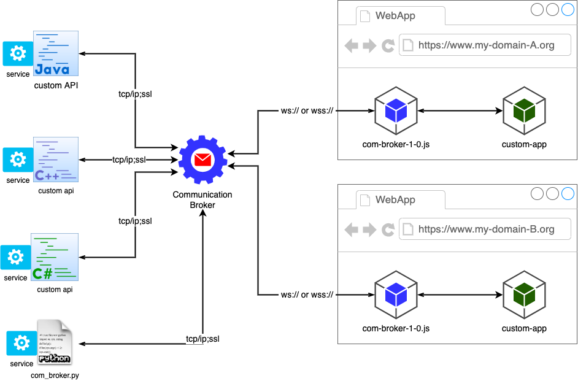
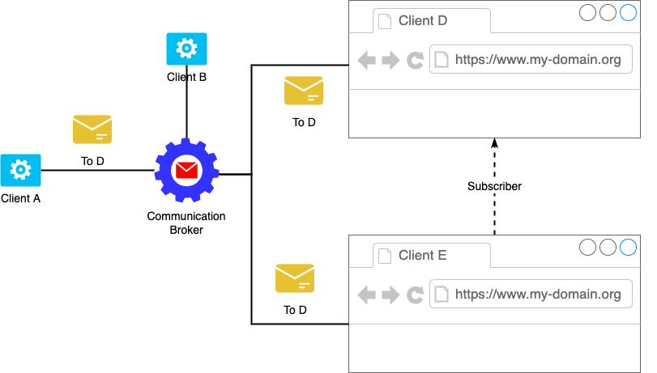
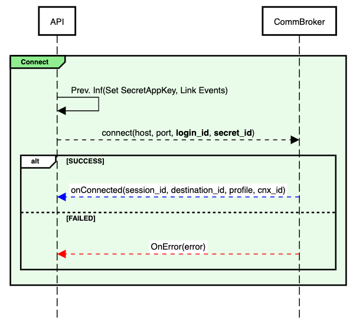
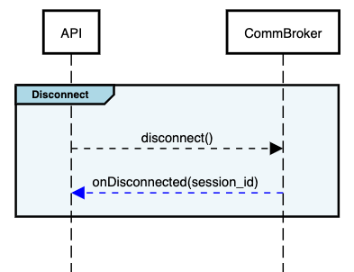
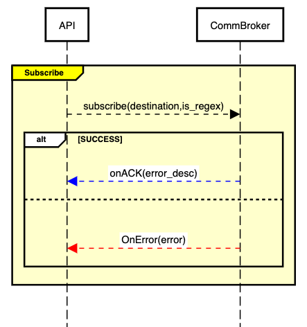
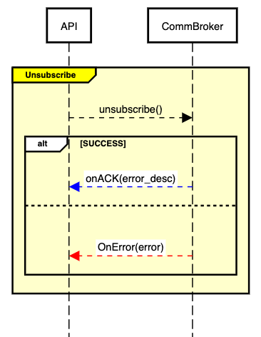
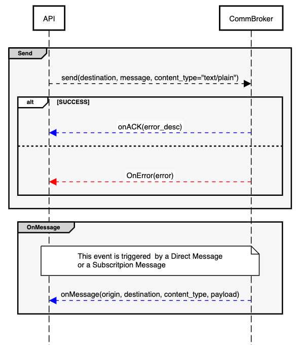

# C++ Communication Broker

## Intro 
Figure out that there is a system that works as a BackEnd and it needs to provide service to several Clients, which are running into a Web Browser besides, It's necessary to establish a communication between the service and the clients that need to be bidirectional and in Real-Time. So, this project pretends to provide a solution to this escenary.

## Overview
The **Communication Broker** is a service to communicate several third applications amont them, like a MQ service but with its specific features, and it's not hanlded persistence of message.

The main idea is leverage some Web applications to communicate to send/receive messaga to a backend servive, through a open connection. 

The **Communication Broker** can receive connections from two diferents interfaces:
+ Websocket Protocol
+ TCP/IP Protocol

Both of then can be set to work with *SSL*.

At this moment, the are developed two apis to integrate with the Communication Broker:

| API | Platform | Protocol |
|--|--|--|
| com_broker.py | Python 3 | TCP/IP |
| com-broker-1-0.js | JS | Wenbsocket |



Also, the **Communication Broker** allows to other clients to receive a copy of message that was sended to another client, through a subsritption. Somethis like a MQ, like Apache MQ does it, but with its own rules.



## Profiles

One of the features of the **Communication Broker** is that it works with four profiles, from which has its own characteristics:

| Profile | Characteristics |
|--|--|
| *AGENT* | The lowest profile. It only can send and receive messages. |
| *SUPER AGENT* | It can send and receive messages and subscribe to to clients that have a profile of *AGENT*. |
| SERVICE | It can send and receive messages and subscribe to to clients that have a profile of *AGENT* or *SUPER AGENT*. |
| ADMIN | It can send and receive messages but not subcribes. This profile is reserve to work directly with **Communication Broker** and control it or to have a Monitor Console.   |

> **Note: There is no an implementation of the ADMIN profile yet, it will come in previous versions.**

To perform a Login, it's necessary to know two secret keys:
| Secret Key | Description |
|--|--|
| Application | The secret key required to connecto to the  **Communication Broker**. |
| Profile | Once the api is connected, it required to know which profile is using. This secret key determines the profile. **There must be 4 *Profile Keys* available to be used by clients.** |


```python
#1. Creating
__app_key__ = "my_app_secret_key"
__agent_prof_key__ = "my_agent_secret_key"
__sagent_prof_key__ = "my_super_agent_secret_key"
__service_prof_key__ = "my_service_secret_key"
__admin_prof_key__ = "my_admin_secret_key"
__cert_path__ = "cert/server.crt"

#Setting the Application Secret Key
client = broker_client("Client-1", __app_key__)

def connect(login_id, profile, use_ssl=False):
    if client.is_connected():
        print("The client is already connected.")
        return
    #...

    #Selecting the Profile Secret Key
    keyprof = ""
    if profile == "agn":
        keyprof = __agent_prof_key__
    elif profile == "sagn":
        keyprof = __sagent_prof_key__
    elif profile == "srv":
        keyprof = __service_prof_key__
    elif profile == "adm":
        keyprof = __admin_prof_key__
    else:
        keyprof = __agent_prof_key__
    
    client.connect(host="localhost", port=6662, server_hostname="MacBook-Pro-de-Jorge.local",
                    login_id=login_id, secret_key=keyprof)
```

## Details

**Communication Broker** implements a protocol based on **STOMP V1.2**, *but it's not a full adaptation of this protocol, so if you want to connect to the **Communication Broker** using a Third Part API of STOMP, you will get problems*. The description of the protocol can be accessed through this [link](https://github.com/jorgemedra/communication_broker/wiki).


# Working with *Communication Broker*

To work with the *Communication Broker*, you must  

## Connect/Login

**Javascript**:

```js
connect(login_id, secret_key)
```

**Python**:

```python
connect(host, port, server_hostname, login_id, secret_key)
```




### Link Events

This methos is required to set the methos that will work as call back events

## Disconnect

>WRITE SOMETHING




## Subscribe

>WRITE SOMETHING




## Unsubscribe

>WRITE SOMETHING



## Send & OnMessage

>WRITE SOMETHING

